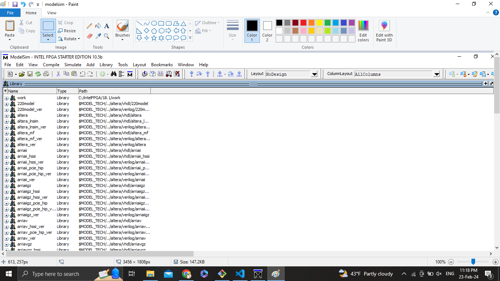
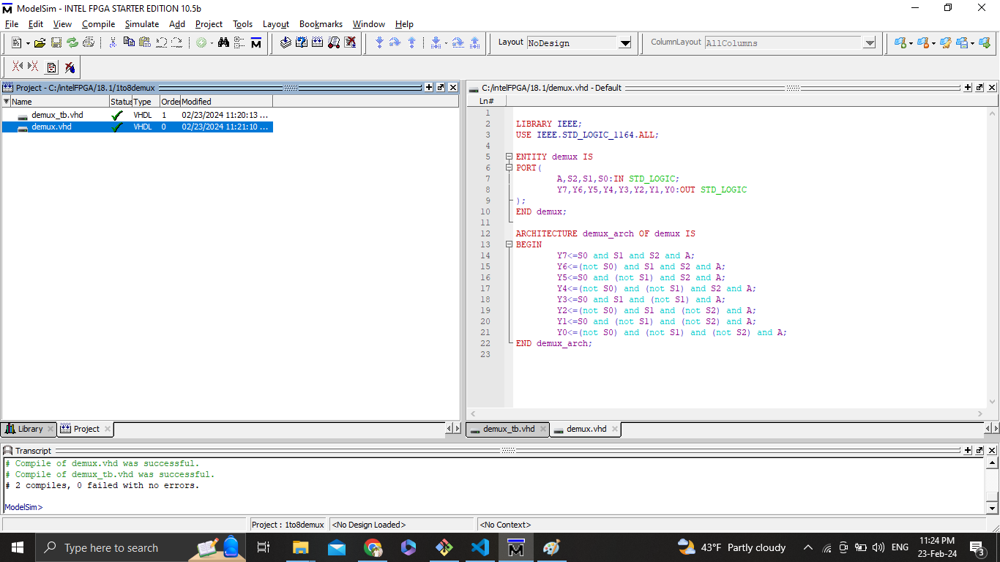
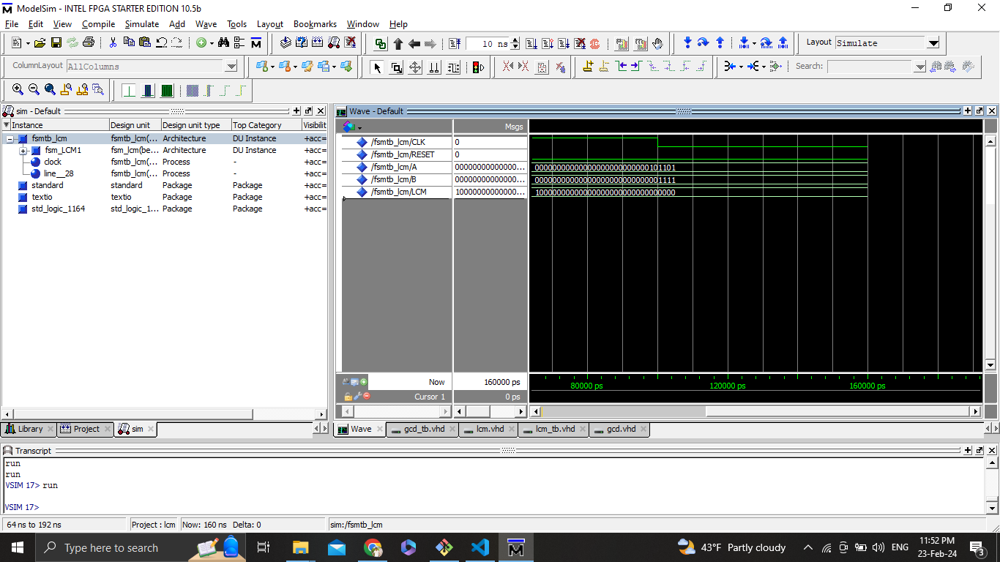
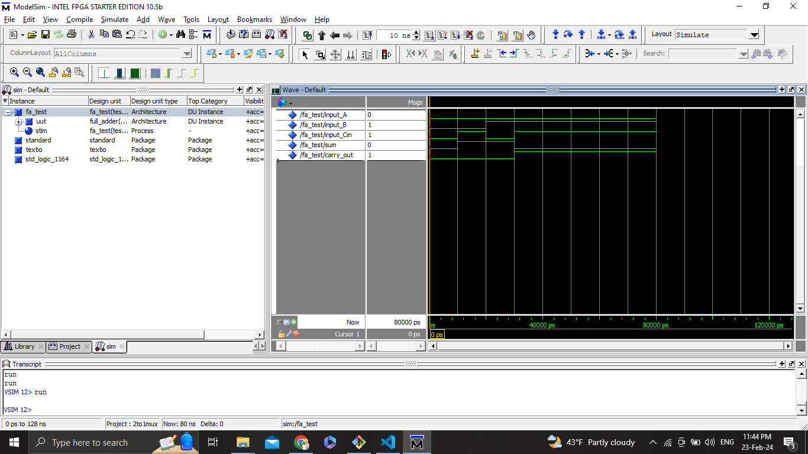

# ModelSim - FPGA Simulation Software

ModelSim is a powerful simulation and debugging tool for FPGA (Field-Programmable Gate Array) designs. It is provided by Intel and is widely used in the industry for designing and testing digital circuits. This repository contains information and resources related to ModelSim, along with any additional tools or scripts that may be useful in conjunction with ModelSim.

## Getting Started

## Installation
To get started with ModelSim, you can download the software from the official Intel website: [ModelSim Download](https://www.intel.com/content/www/us/en/software-kit/750368/modelsim-intel-fpgas-standard-edition-software-version-18-1.html)

Follow the installation instructions provided by Intel to set up ModelSim on your system.

## Contents

This repository includes:

- Documentation: Useful guides, manuals, and reference materials for ModelSim.
- Examples: Sample VHDL designs and testbenches to help you understand how to use ModelSim effectively.

# Using ModelSim for VHDL Simulation

This guide provides step-by-step instructions on using ModelSim to simulate VHDL code. 

1. Download and install ModelSim from the [Intel website](https://www.intel.com/content/www/us/en/software/programmable/quartus-prime/download.html).
2. Follow the installation instructions provided by Intel.

## Getting Started

1. Launch ModelSim after installation.

2. Create a New Project:
   - Open the File menu and select "New Project."
   - Follow the wizard to create a new project.
   - Specify the project name, location, and choose the appropriate project settings.

3. Add VHDL Files:
   - Add your VHDL files to the project.

4. Compile:
   - Once your files are added, compile the project to check for syntax errors and generate the simulation files.

5. Simulate:
   - Create a new simulation by selecting "New Simulation" from the Simulation menu.
   - Choose the simulation type (e.g., RTL Simulation).
   - Add your top-level entity to the simulation.

6. Run Simulation:
   - Start the simulation. This can be done using the run button in the toolbar or the `vsim` command in the transcript window.
   - A simulation window will open, showing the waveforms and simulation results.

7. Waveform Analysis:
   - Analyze waveforms to debug and verify your design.
   - Add signals to the waveform viewer to monitor their behavior.

8. View Results:
   - Examine the simulation results for correctness.
   - If needed, make adjustments to your VHDL code and repeat the compile and simulation steps.

9. Terminate Simulation:
   - Once you've completed the simulation, terminate it either through the GUI or by using the `quit` command in the transcript window.

## 1To8_Demux 
## lcm 
## Fulladder 
